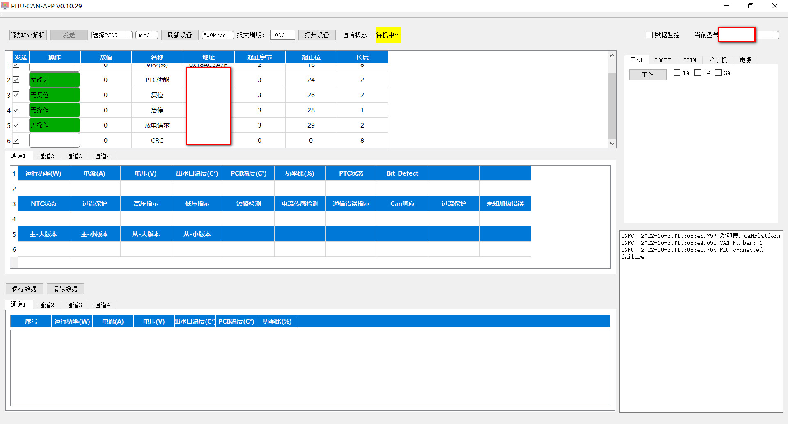
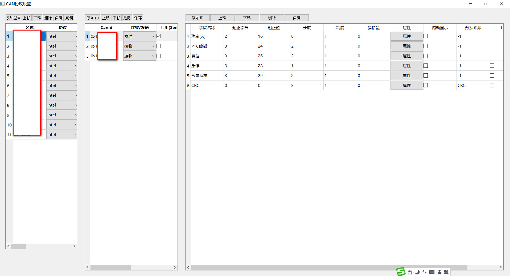

#  QtCanPlatform
QtCanPlatform是一款用于测试CAN设备的可视化编辑软件，他可以根据CAN协议设置对应的字段参数，来测试设备。
# 编译环境 #
* 编译环境：VS2022+QT5.14.2 
* 操作系统：Windows10
# 支持的CAN设备  
* PCAN、RCAN、ECAN、kvaser等，后续会添加更多
# 编译使用  
* 下载之后，用VS打开.sln文件，设置好QT版本
* 编译  
#界面如下
## 主界面
  
## 设置界面

# 软件使用
* 设置好CAN协议
* 刷新设备
* 选择波特率
* 打开设备
* 选择型号
* 点击发送