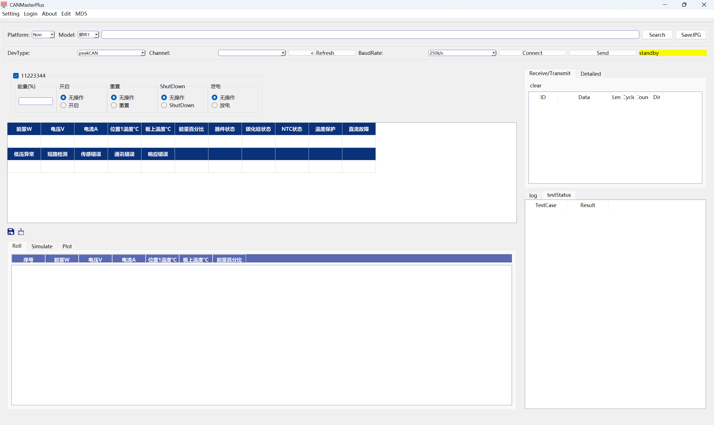

### 全新版本的可视化CAN平台分析工具更新啦k

本次更新重写了好多个模块，特别是模型管理的那部分，以及接收显示区域，性能更好，显示更流畅

目前已经注册下面的几个CAN盒子型号，后面根据需要，自己添加进去：
```cpp
    CReflectClass<DeviceIO>::registerClass<peakCAN>();
    CReflectClass<DeviceIO>::registerClass<peakLIN>();
    CReflectClass<DeviceIO>::registerClass<CANalyst>();
    CReflectClass<DeviceIO>::registerClass<zlgCAN>();
```



#### 使用方法
##### 1、接入CAN设备
##### 2、选择型号
##### 3、点击connect,然后 send